# LIFE-KITZ

## ABOUT

Life-Kitz is designed to be your personal tooling for everyday activities.

Add a kit for your needs.
Remove a kit when no longer needed.

Life-Kitz will be your go to multi-tool from simple to advanced tasks!

## API INFO

- News API: [Slightly Used API](https://newsapi.org/)
- API NINJAS: [Most Abused API](https://api-ninjas.com/)
  - weather/
  - world-time/
  - jokes/
  - quotes/

## MVP

- All requirements from CP [rubric](https://www.youtube.com/watch?v=dQw4w9WgXcQ)
- News Kit
- Weather Kit
- Time Kit
- Jokes Kit
- Quotes Kit

## TOOLING

- NextJS - FE
  - TailwindCSS (Utility Styles)
  - DaisyUI (Component Library)
  - React-Icons (Icons)
  - ...
- Django/DRF - BE
  - ...

## WIRE-FRAMES AND BRAINSTORMING

### FIGMA

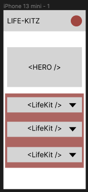

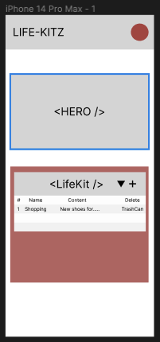

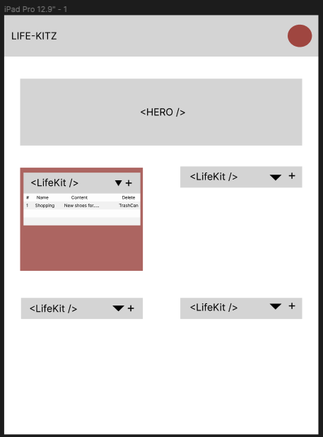

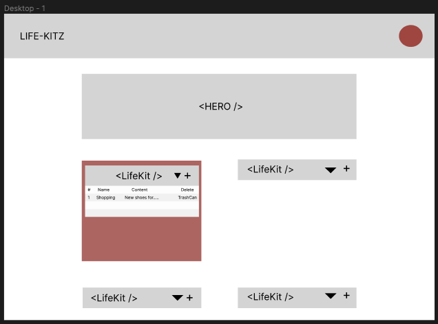

### WHITEBOARD

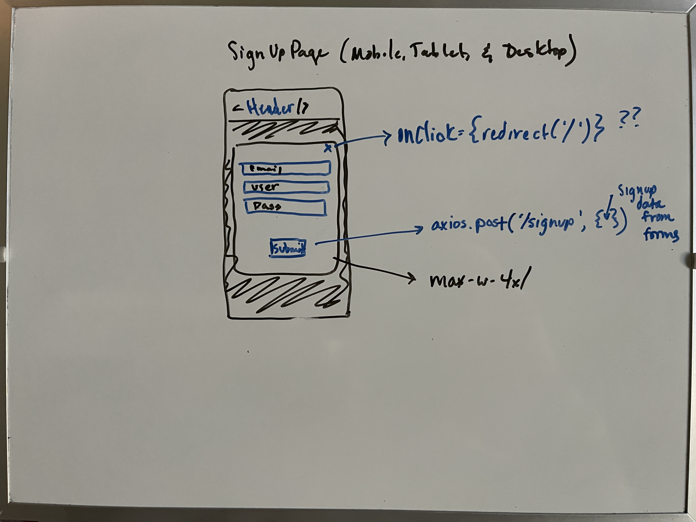
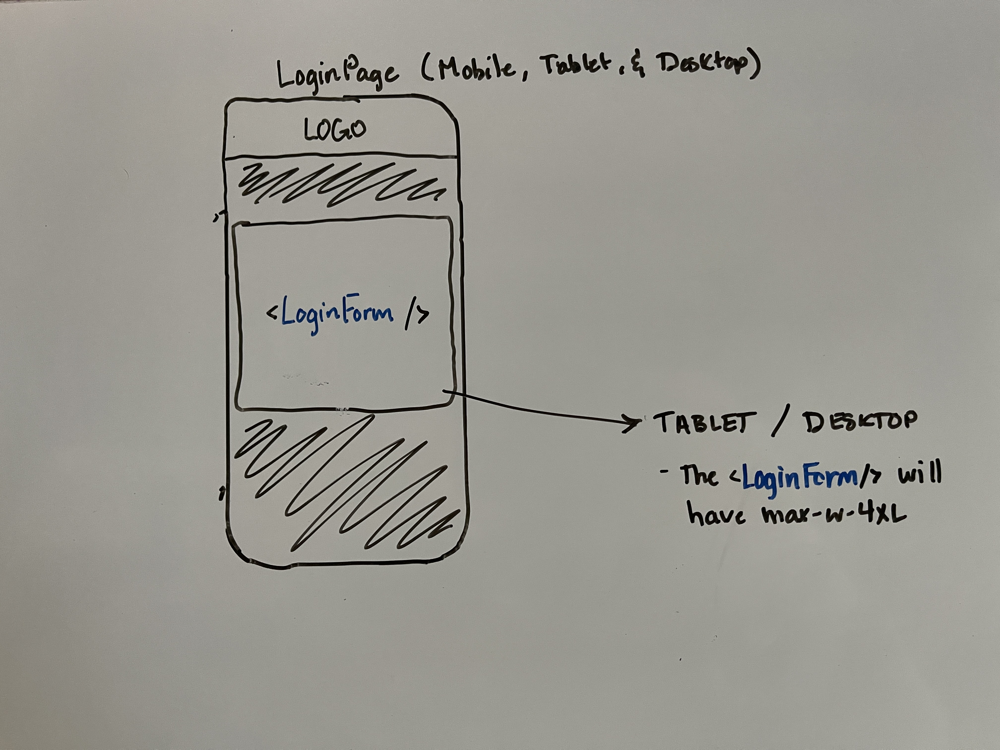
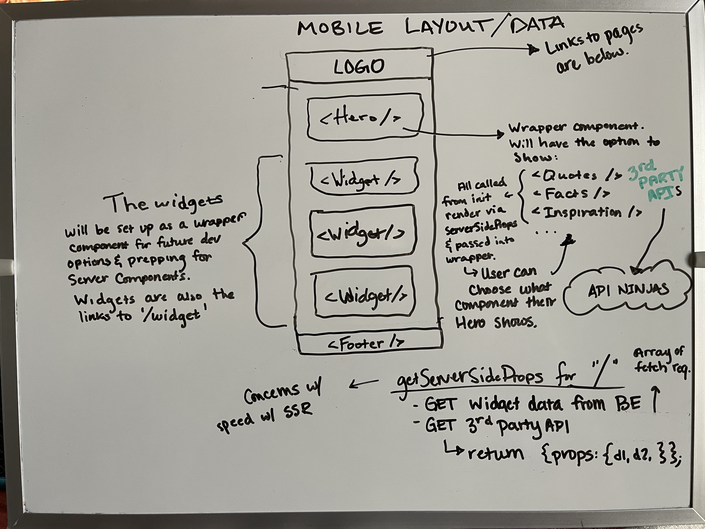
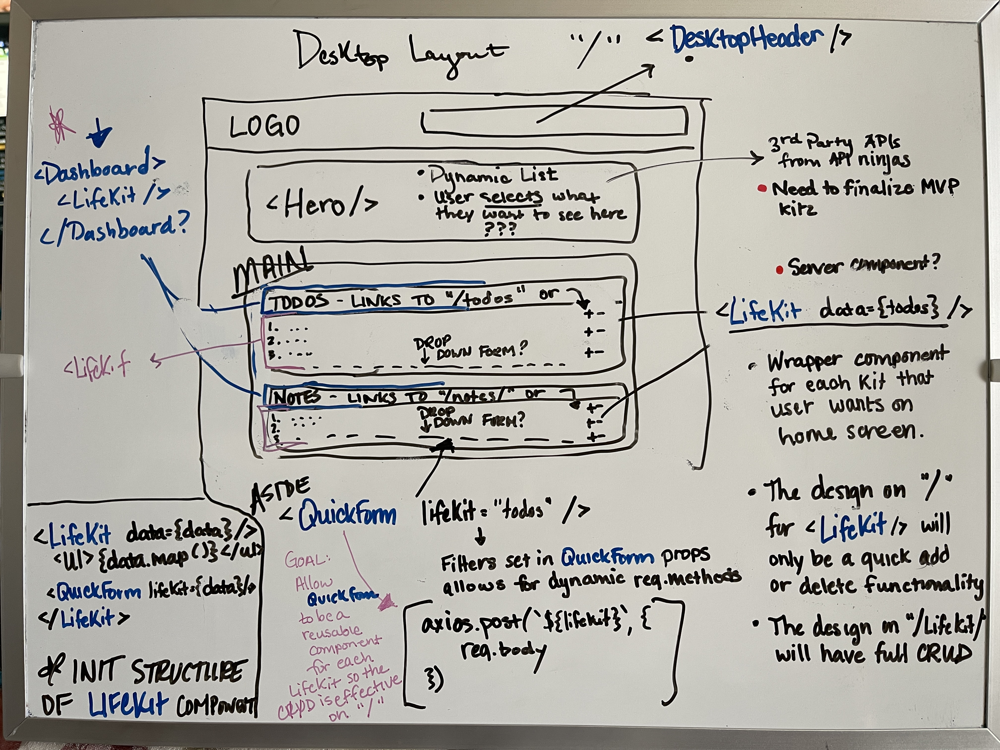
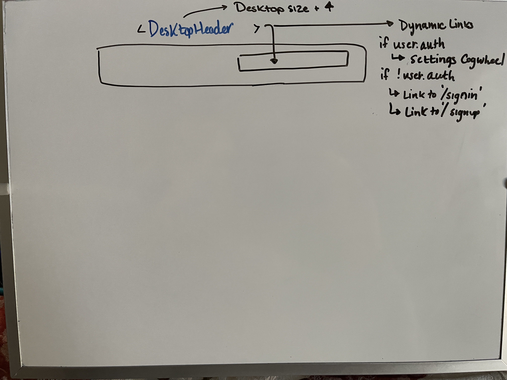
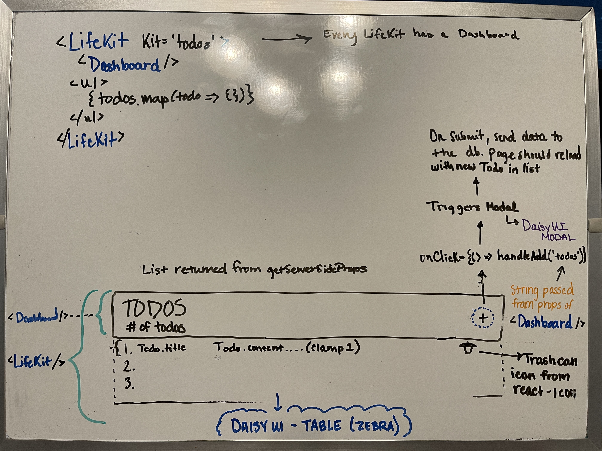
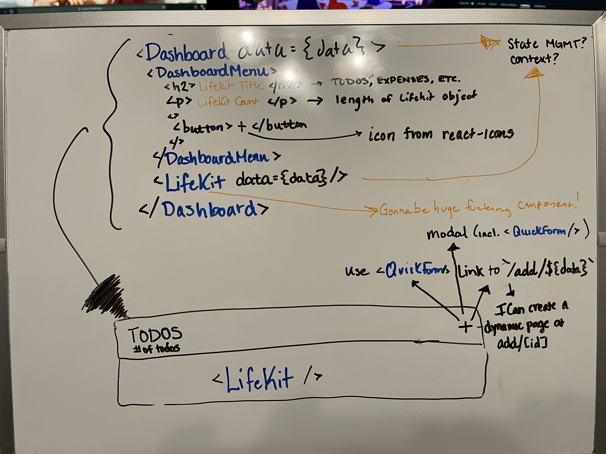
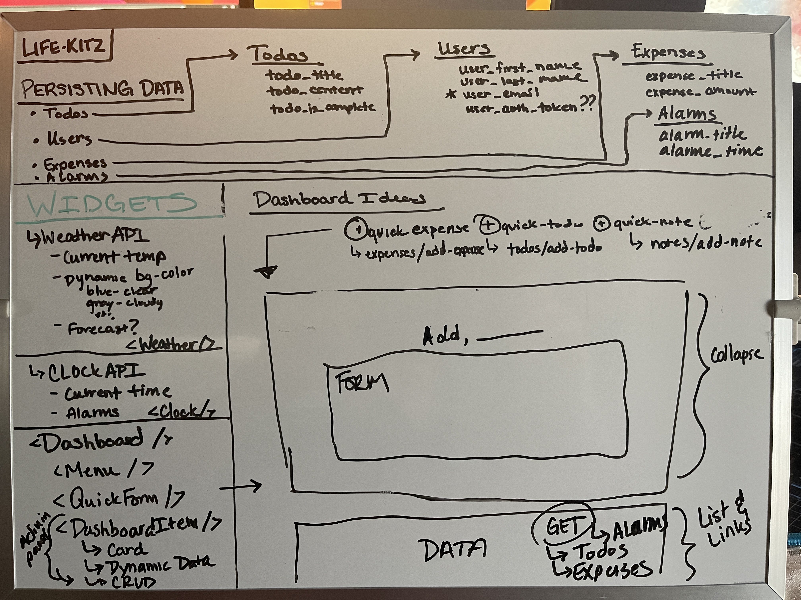
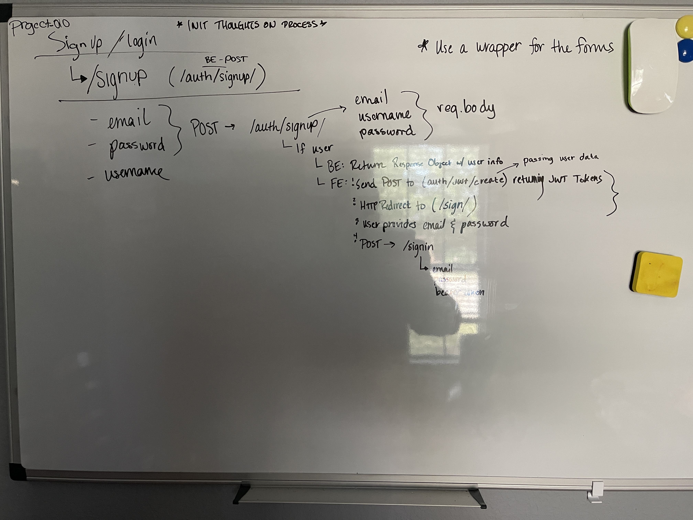
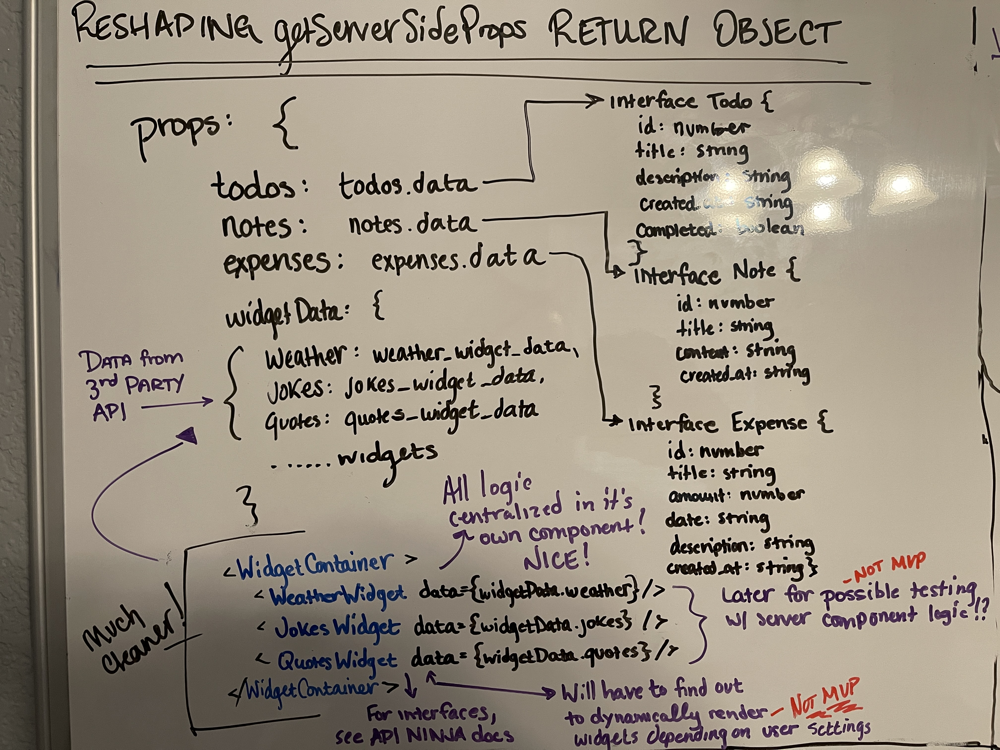
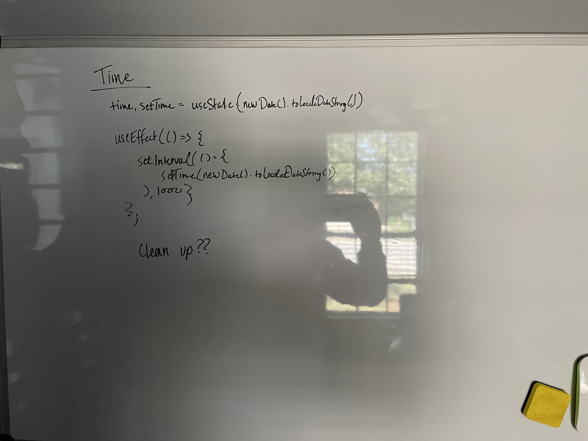

  
## SQL SCHEMA

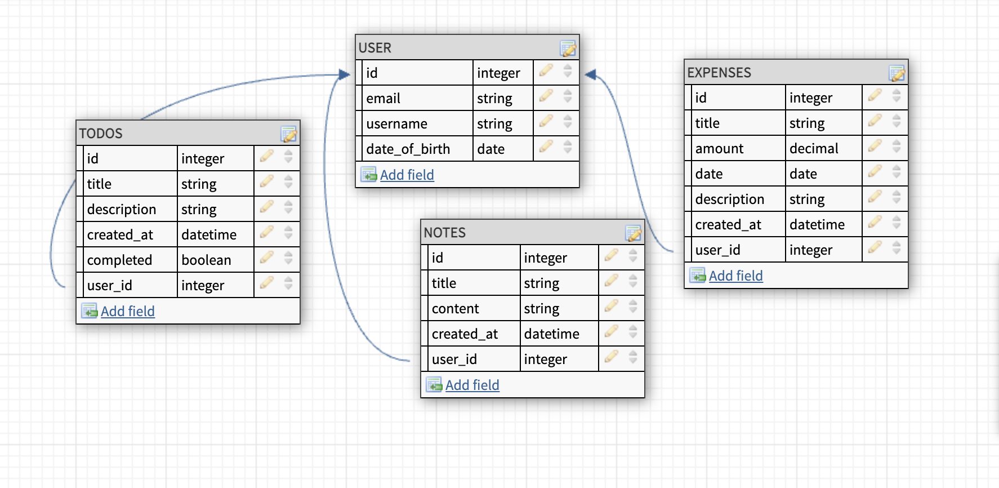
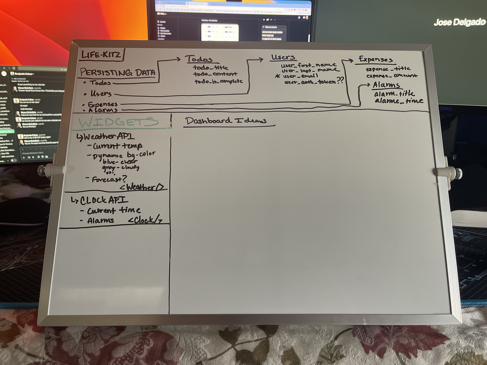

## STRETCH GOALS

- Update the CP RUBRIC to proper url  :)
- Add more kits by abusing the API-NINJAS api
- Drag and drop features within kits
- Pomodoro Timer/Kit
